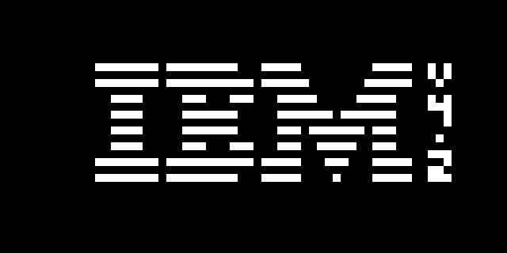
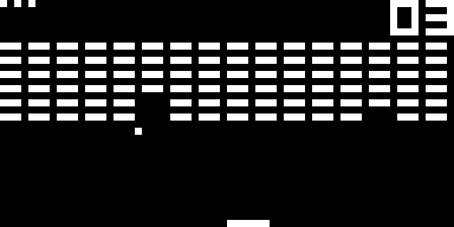
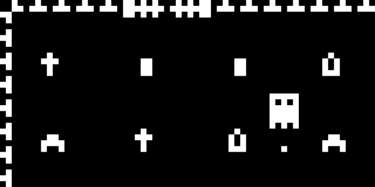

# CHIP8CHAPA

A CHIP-8 emulator written in C++.

## Features
- Emulates the classic CHIP-8 virtual machine
- SDL2-based graphics, input, and sound
- Modular design (CPU, memory, display, input, timers, sound)

## Dependencies
- [CMake](https://cmake.org/) (version 3.10 or higher)
- [SDL2](https://www.libsdl.org/) (included in `deps/SDL2-2.32.8`)

## Building (Windows)
1. **Clone the repository** (if you haven't already):
   ```sh
   git clone <repo-url>
   cd CHIP8CHAPA
   ```
2. **Configure the project with CMake:**
   ```sh
   cmake -S . -B build
   ```
3. **Build the project:**
   ```sh
   cmake --build build --config Release
   ```
   The executable will be located in the `build/` directory (named `CHIP8CHAPA.exe`).

## Project Structure
- `main.cpp` - Entry point
- `chip8_cpu.*` - CPU emulation
- `chip8_memory.*` - Memory management
- `chip8_display.*` - Graphics
- `chip8_input.*` - Input handling
- `chip8_timers.*` - Timers
- `chip8_sound.*` - Sound
- `config.*` - Configuration

## Screenshots

Here are some screenshots of CHIP8CHAPA in action:





## Credits
- SDL2: [https://www.libsdl.org/](https://www.libsdl.org/)
- All the cool online resources!!!! (there's so many O_O)

---
Feel free to contribute or report issues! 
